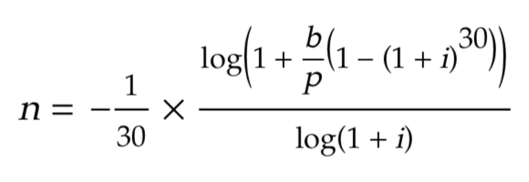

## Months to Pay Off a Credit Card

It can take a lot longer to pay off your credit card balance than you might realize. And the formula for figuring that out isn’t pretty. Hiding the formula’s complexity with a function can help you keep your code organized.

Write a program that will help you determine how many months it will take to pay off a credit card balance. The program should ask the user to enter the balance of a credit card and the APR of the card. The program should then return the number of months needed.

The formula for this is



where

- `n` is the number of months.
- `i` is the daily rate (APR divided by 365). \* b is the balance.
- `p` is the monthly payment.

### Example Output

```
What is your balance? 5000
What is the APR on the card (as a percent)? 12
What is the monthly payment you can make? 100
It will take you 70 months to pay off this card.
```

### Constraints

- Prompt for the card’s APR. Do the division internally.
- Prompt for the APR as a percentage, not a decimal.
- Use a function called `calculateMonthsUntilPaidOff`, which accepts the balance, the APR, and the monthly payment as its arguments and returns the number of months. Don’t access any of these values outside the function.
- Round fractions of a cent up to the next cent.
