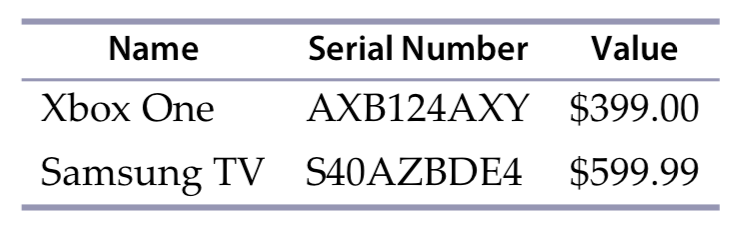

## Tracking Inventory

Write a program that tracks your personal inventory. The program should allow you to enter an item, a serial number, and estimated value. The program should then be able to print out a tabular report in both HTML and CSV formats that looks like this:

### Contraints

- Store the data in a persistent local data file in JSON, XML, or YAML format.
- Require numeric data for the value of each item.
